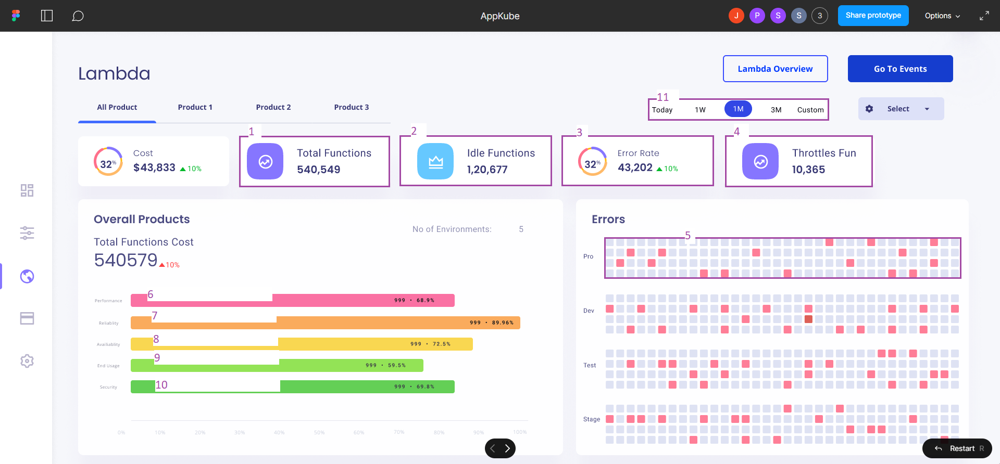
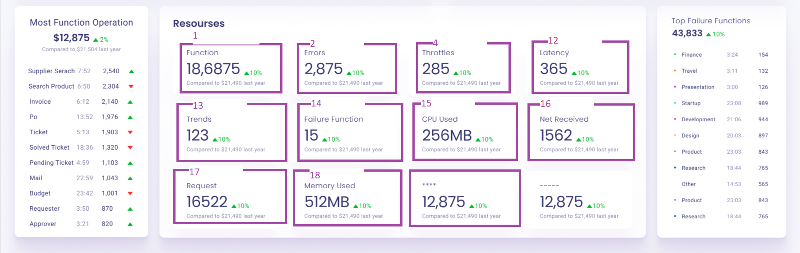

| Section no. | Data Format(Api/Metrics/Log/Trace) |  Source detail | Description | Logic |
|-------------|------------------------------------|----------------|-------------|-------|
| 1 | Custom API | API => `/count/all`, CLI => `lambda count --all=true` |  It gives total number of lambda functions present in aws account | -- |
| 2 | CWL | Q => `limit 1` | It gives total number of idle lambda functions present in aws account | run query for every lambda in 1 month period and if result is 0 then it is idle function |
| 3 | CWL | Q => `filter @message like /(?i) (Exception \| error \| fail \| 5dd)/ \| stats count() as ErrorCount` | It gives total number of errors in lambda functions present in aws account | Run query for all lambdas and it will give total number of errors |
| 4 | Metrics | Q => `SELECT SUM("Throttles") FROM "AWS/Lambda" WHERE "FunctionName" = '<function_name>' AND "ResourceType" = "Function" AND "Period" = 300 AND "StartTime" >= now() - 24h AND "EndTime" <= now()` | It gives total number of throttle lambda functions present in aws account (exceeding fixed limit) | run this query for all lambdas and get total throttels for last 24 hours |
| 5 | CWL | Q => `fields @message, @logStream \| sort @timestamp desc \| limit 5 \| filter @message like /ERROR/`  | It gives a fucntion have error or not in last some executions | If it gives data means error was present other wise null result returns |
| 6 | API/ metric | API => `/performance`, CLI => `lambda performance` |  It gives overall performance percentage | -- |
| 7 | API/ metrics | API => `/reliability`, CLI => `lambda reliability`  | It gives overall reliability percentage | -- |
| 8 | API/ metrics | API => `/avalibility`, CLI => `lambda avalibility`   | It gives overall avalibility percentage |  -- |
| 9 | API/ metrics | API => `/endUsage`, CLI => ` lambda endUsage`  | It gives overall endUsage percentage | -- |
| 10 | API/ metrics | API => ` /security`, CLI => `lambda security` |   It gives overall security percentage | -- |
| 12 | CWL | Q => `stats avg(@duration)`  | It gives average latency of all lambda functions | Run this query for all fucntions to get average latency for all function |
| 13 | CWL | Q => `stats count() by @logStream` |  It gives top 10 most executed lambdas in given range of time | Run query for all functions and get top executed fucntions |
| 14 | CWL | Q => `fields @message, @logStream \| sort @timestamp desc \| limit 5 \| filter @message like /ERROR/` | It gives number of lambda that are failed in last executions | If it gives data means error was present other wise null result returns |
| 15 | metrics | -- | It gives average cpu used by all lambda function | -- |
| 16 | metrics | -- | It total number of zones that containes lambdas | -- |
| 18 | CWL | Q => `fields @maxMemoryUsed/ 10000000 as memoryUsed_MB` | It gives average memory used by all lambdas | Run this for all lambdas and get average memory used |

## -- 11
Time range params in every command and api

1. Cli command

        lambda --startDate=<> --endDate=<>
2. api

    - params - 
        - startDate = <>
        - endDate = <>
